# Poker Fun

Poker Fun is a JavaScript game built to allow users to play a game of poker online for fun. It was built to work like the original poker arcade games and is single player.

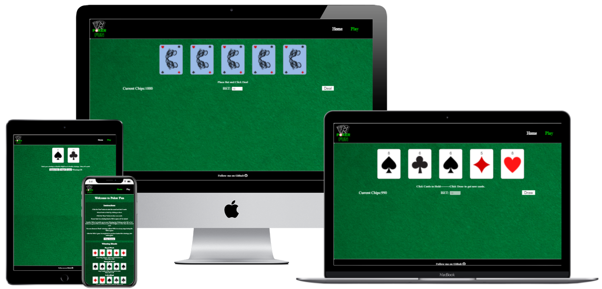

[Poker Fun Live Link](https://gareth-mcgirr.github.io/Portfolio-Project-2-Poker-Fun)

## Features

### Site wide
* Navigation Menu
    * Contains links to the Home and Game pages and will be responsive on all devices.
    * This will allow users to easily navigate between the pages within the site on any size device. 


* Footer
    * This will contain a link to my GitHub page and a font awesome icon to make it more visually appealling. Link will open in a new tab when clicked.
    * This will allow the user to follow me on my Github page


* Favicon
    * A site wide favicon will be implemented with a red poker chip.
    * This will provide an image in the the tabs header to allow the user to easily identify the website if they have multiple tabs open.

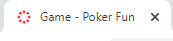
* 404 Page
    * A 404 page will be implemented and will display if a user navigates to a broken link.
    * The 404 page will allow the user to easily navigate back to the main website if they direct to a broken link / missing page, without the need  of the browsers back button.

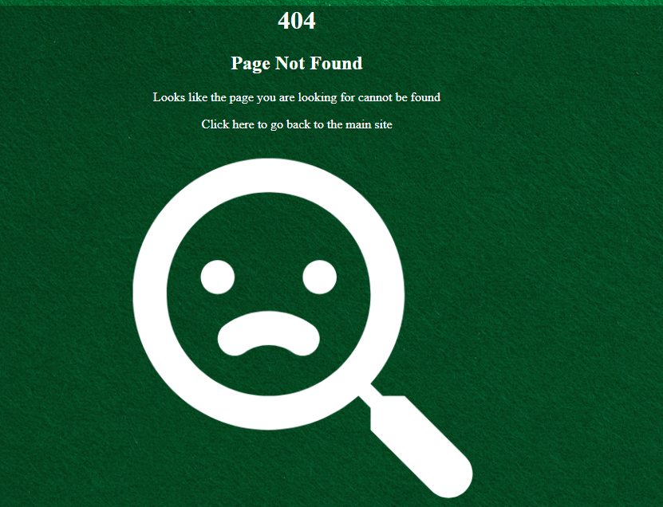

*Home Page*

- Game Instructions
  - The home page content contains full game instructions so that the user is able to understand how to play the game.

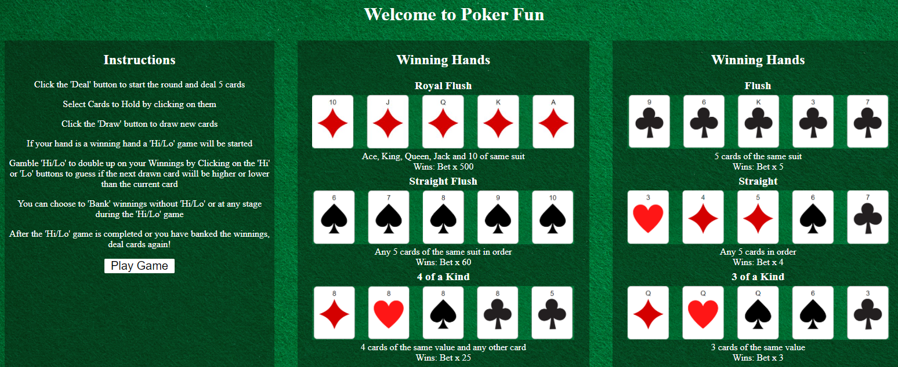  
- Game Start Button
  - A button will be on the home page that when clicked will direct the user to the main poker game.
  - This will allow the user to start the game after they have read and understood how the game works.

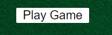

*Game Page*

- Chip Balance

  - Below the main game area, the users current chips are displayed which is defaulted to 1000 starting chips when the user intiates game play. The users chip balance is displayed at all times. The chip balance is updated when the user bets or wins a hand.
  - This will allow the user to keep track of how many chips they have in order to decide how much they would like to bet.

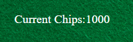
- Betting Functionality

  - Before the user initiates the round with the deal button, there is an input box that will allow them to bet some of their chips on the hand. The input is type number and is set to default at 10 and increments / decrements in multiples of 10. A user cannot bet more chips than their current chip balance.
  - This will allow the user to gamble their chosen amount on each hand before the round is started.

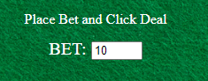
- Deal

  - In order to start the poker hand, there will be a deal button just under the main table. When this button is clicked, it will draw the initial five cards for the poker hand.
  - This will allow the user to start the hand once they have added their bet amount and are ready to proceed.

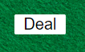
- Cards

  - The game board contains the cards for the poker game. A Maximum of five cards will be on the board at any one time. Initially cards will be face down before deal and will be shown faceup when deal button is clicked.
  - This will allow the user to keep track of what cards are in their hand.

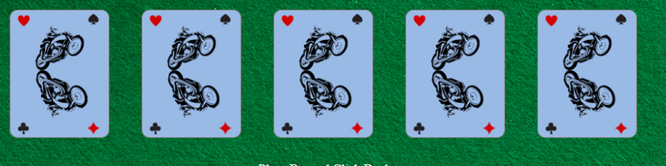
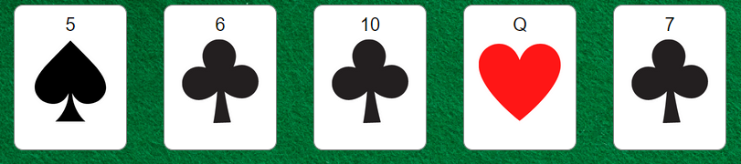
- Hold

  - After the hand has been dealt and five cards are displayed on the game board, you can hold cards before drawing new ones. You keep the cards you hold and the remaining cards will be replaced with new ones. In order to hold the card, you click it and the card will appear to raise and visible text will be displayed with 'Hold'.
  - This will allow users to keep the best cards from their hand.

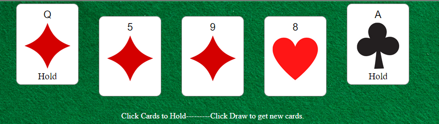
- Draw

  - Once the user has decided which cards they want to hold, if any, they can click the draw button to get new cards.
  - This will allow users to get new cards in an attempt to get a better hand than the original dealt cards.

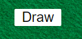
- Gamble Winnings   

  - If the user has a winning hand after they have drawn the cards, they will be given the option to gamble those winnings or bank the chips. The user will be presented with a single card and they have to guess whether the next card drawn will be higher or lower than the current card. This will be done by using the respective 'High and 'Low' buttons.
  - If the user guesses wrong, they will lose the winnings.
  - If the user guesses right, the winnings will be doubled on each successful guess up to a maximum of 5 cards on the table and winning chips will be added to the current chip balance.
  - If the user decides to bank the winnings, the winning chips will be added to the current chip balance. The user will then be able to start the next hand.
  - This will allow the user gamble and potentially increase their winning chips or take the safe option and bank the winnings.

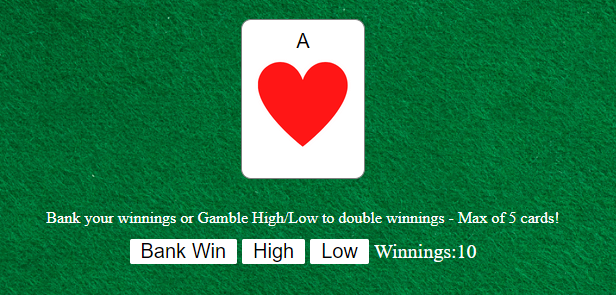

*Winning Hands*
- Royal Flush
  - Ace, King, Queen, Jack and 10 of same suit
    - Wins: Bet x 500
           
            
- Straight Flush
  - Any 5 cards of the same suit in order
    - Wins: Bet x 60
          
           
- 4 of a Kind
  - 4 cards of the same value and any other card
  - Wins: Bet x 25          
- Full House
  - 3 cards of same value and 2 cards of another value
    - Wins: Bet x 10
- Flush
  - 5 cards of the same suit
    - Wins: Bet x 5
            
- Straight
  - Any 5 cards in order
    - Wins: Bet x 4
          
- 3 of a Kind
  - 3 cards of the same value
    - Wins: Bet x 3
            
- 2 Pairs
  - 2 pairs of the same value
    - Wins: Bet x 2
            
- Pair - Jacks or Better
  - pair of J, Q, K or A
    - Wins: Bet x 1
          
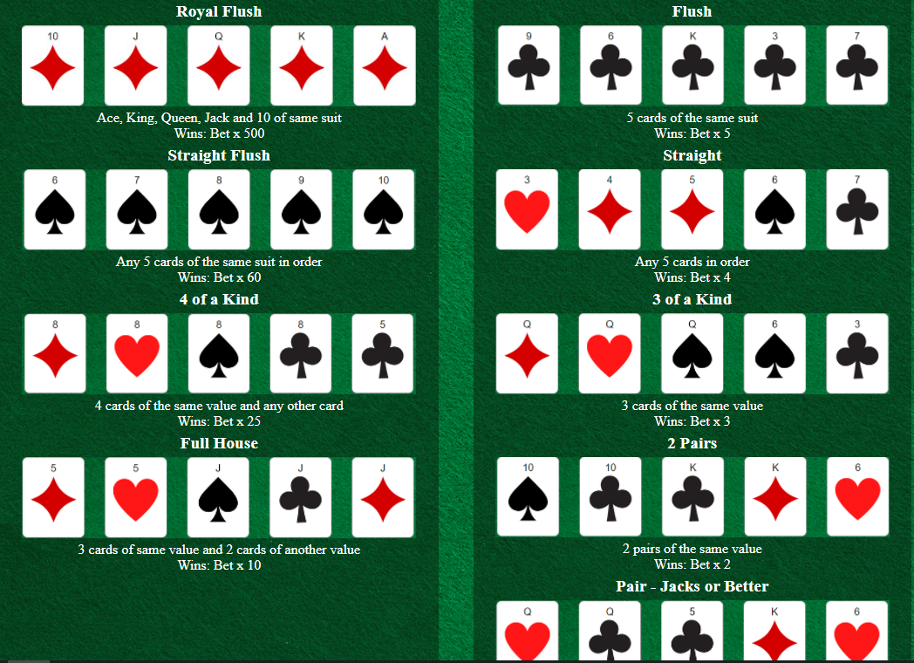

## Wireframes

- Home page

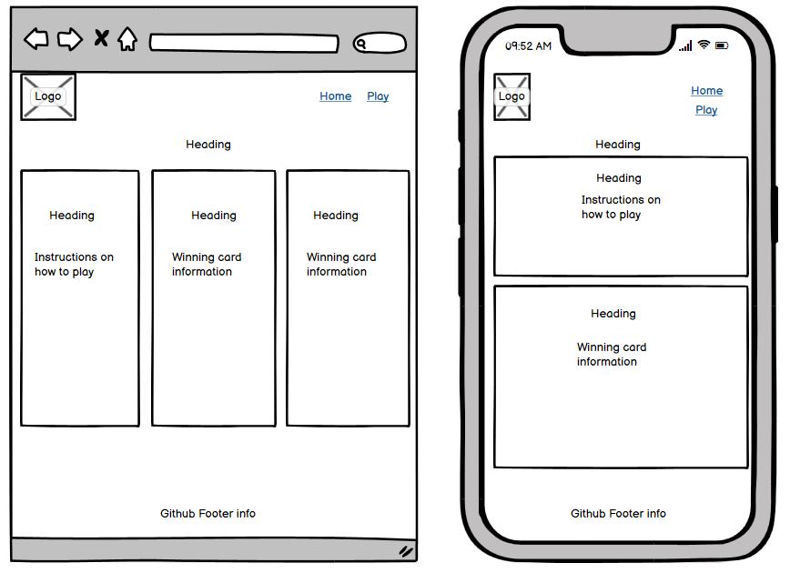

- Game page

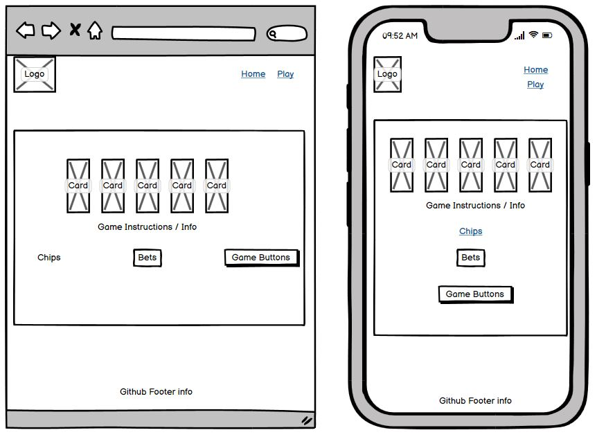

- 404 page

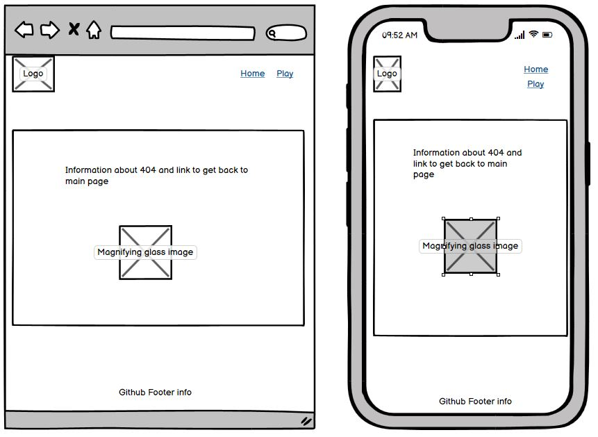
## Technolgies

- HTML
  - The structure of the Website was developed using HTML as the main language.
- CSS
  - The Website was styled using custom CSS in an external file.
- JavaScript
  - The game play logic was created using JavaScript in an external file.
- Visual Studio Code
  - The website was developed using Visual Studio Code IDE
- GitHub
  - Source code is hosted on GitHub and delpoyed using Git Pages.
- Git
  - Used to commit and push code during the development of the Website
- Font Awesome
  - Icon obtained from https://fontawesome.com/ was used for GitHub Icon in the footer.
- Favicon.io
  - favicon files were created at https://favicon.io/favicon-converter/
- balsamiq
  - wireframes were created using balsamiq from https://balsamiq.com/wireframes/desktop/#
- Canva
  - This was used to create the logo in header and make the images for cards 

## Testing

### Responsiveness

All pages were tested to ensure responsiveness on screen sizes from 320px and upwards as defined in [WCAG 2.1 Reflow criteria for responsive design](https://www.w3.org/WAI/WCAG21/Understanding/reflow.html) on Chrome, Edge, Firefox and Opera browsers.

Steps to test:

1. Open browser and navigate to [Poker Fun](https://gareth-mcgirr.github.io/Portfolio-Project-2-Poker-Fun/)
2. Open the developer tools (right click and inspect)
3. Set to responsive and decrease width to 320px
4. Set the zoom to 50%
5. Click and drag the responsive window to maximum width

Expected:

Website is responsive on all screen sizes and no images are pixelated or stretched.
No horizontal scroll is present.
No elements overlap.

Actual:

Website behaved as expected.

Website was also opened on the following devices and no responsive issues were seen:

- Oukitel C21 Pro
- TCL 30 Pro
- iPhone SE

### Accessibility

[Wave Accessibility](https://wave.webaim.org/) tool was used throughout development and for final testing of the deployed website to check for any aid accessibility testing.

Testing was focused to ensure the following criteria were met:

- All forms have associated labels or aria-labels so that this is read out on a screen reader to users who tab to form inputs
- Color contrasts meet a minimum ratio as specified in [WCAG 2.1 Contrast Guidelines](https://www.w3.org/WAI/WCAG21/Understanding/contrast-minimum.html)
- Heading levels are not missed or skipped to ensure the importance of content is relayed correctly to the end user
- All content is contained within landmarks to ensure ease of use for assistive technology, allowing the user to navigate by page regions
- All not textual content had alternative text or titles so descriptions are read out to screen readers
- HTML page lang attribute has been set
- Aria properties have been implemented correctly
- WCAG 2.1 Coding best practices being followed

Manual tests were also performed to ensure the website was accessible as possible and some accessibility issues were identified.

Issue #1: Suits were not read to assistive technology.

Fix: A span was appended to the card elements to read the suit using the "sr-only" build in class so it was not displayed but is read to a screen reader. This was tested using windows narrator screen reader.

Issue #2: Cards were not tabbable with the keyboard.

Fix: Cards were given the tabindex attribute with a value of 1 to ensure a keyboard can tab to them.

Issue #3: Cards were not held with the enter key so users could not hold the card unless clicked with a mouse.

Fix: Cards were given an onkeyup event and called a new function which detects if the enter key was pressed and then clicks the card to allow the user to hold the card.

**Navigation Links**

Testing was performed to ensure all navigation links on the respective pages, navigated to the correct pages as per design. This was done by clicking on the navigation links on each page.

| Navigation Link | Page to Load    |
| --------------- | --------------- |
| Home            | index.html      |
| Play            | game.html       |

Links on all pages navigated to the correct pages as exptected.

**Footer Link**

Testing was performed to ensure the GitHub icon in the footer opened the github profile of Gareth-McG in a new tab. This was done by clicking the GitHub icon.

Gareth-McG's Github profile opened in a new tab.

**Game Play**

**Winning Hands**

All hands were tested to ensure they were recorded as the correct 'winning hands' with the correct multipliers. This was done by stubbing the hands using the following arrays:

```
Royal Flush Test
myHand[0] = deck[09];
myHand[1] = deck[10];
myHand[2] = deck[11];
myHand[3] = deck[12];
myHand[4] = deck[0];

Straight Flush Test
myHand[0] = deck[31];
myHand[1] = deck[32];
myHand[2] = deck[33];
myHand[3] = deck[34];
myHand[4] = deck[35];

Flush Test
myHand[0] = deck[47];
myHand[1] = deck[44];
myHand[2] = deck[51];
myHand[3] = deck[41];
myHand[4] = deck[45];

4 of a kind Test
myHand[0] = deck[7];
myHand[1] = deck[20];
myHand[2] = deck[33];
myHand[3] = deck[46];
myHand[4] = deck[43];

Full House
myHand[0] = deck[4];
myHand[1] = deck[17];
myHand[2] = deck[36];
myHand[3] = deck[49];
myHand[4] = deck[10];

Straight
myHand[0] = deck[15];
myHand[1] = deck[3];
myHand[2] = deck[4];
myHand[3] = deck[31];
myHand[4] = deck[45];

Straight A2345
myHand[0] = deck[0];
myHand[1] = deck[14];
myHand[2] = deck[28];
myHand[3] = deck[42];
myHand[4] = deck[4];

3 of a kind
myHand[0] = deck[11];
myHand[1] = deck[24];
myHand[2] = deck[37];
myHand[3] = deck[31];
myHand[4] = deck[41];

2 pair
myHand[0] = deck[35];
myHand[1] = deck[48];
myHand[2] = deck[51];
myHand[3] = deck[12];
myHand[4] = deck[18];

pair of queens
myHand[0] = deck[24];
myHand[1] = deck[50];
myHand[2] = deck[43];
myHand[3] = deck[12];
myHand[4] = deck[18];
```
All hands functioned as expected and gave the correct types and winnings.

**Hold Cards**

Testing was performed to ensure cards could be held and when new cards were drawn, the selected cards remained. Thhis was done by selecting 2 cards from the dealt cards, then pressing the draw button.

When new cards were drawn, the held cards were still in the drawn cards as expected.

**Game Board**

Testing was done to ensure the correct messages were displayed at the appropriate time by playing the game. The following messages are displayed:

* No winning hand - Displayed when no winning hand has been dealt.
* Place bet instructions - Shown when facedown cards are drawn.
* Hold card instructions - Shown after user has clicked the 'Deal' button.
* Winning hand name displayed - Shown if winning hand after user has clicked the draw button after a deal/hold.
* High low instructions - Shown during high low game that is initiated if a user had a winning hand.
* Lose High/Lo with wrong High guess - Shown if user guesses 'High' but the card drawn was a lower value than the previous card.
* Lose High/Lo with wrong Low guess - Shown if user guesses 'Low' but the card drawn was a higher value than the previous card.

All messages were displayed as expected.

**High/Low**

High/Low game was tested to ensure the game functioned as expected by playing the game:
* If the card drawn was higher and the user clicked the "High" button, that the next card was drawn as expected.
* If the card drawn was lower and the user clicked the "Low" button, that the next card was drawn as expected.
* If the card drawn was lower and the user clicked the "High" button, that the next card was not drawn and the High/Low game ends as expected.
* If the card drawn was lower and the user clicked the "High" button, that the next card was not drawn and the High/Low game ends as expected.
* If the maximum limit of 5 cards has been drawn, the high low game ends and winnings are added to the current chip balance as expected.
* At any stage in the High/Lo game, if the 'Bank Winnings' button is clicked, the current winnings are added to the current chips value.


## Deployment

### Version Control

The site was created using the Visual Studio Code editor and pushed to github to the remote repository ‘Portfolio-Project-2-Poker-Fun’.

The following git commands were used throughout development to push code to the remote repo:

```git add <file>``` - This command was used to add the file(s) to the staging area before they are committed.

```git commit -m “commit message”``` - This command was used to commit changes to the local repository queue ready for the final step.

```git push``` - This command was used to push all committed code to the remote repository on github.

### Deployment to Github Pages

- The site was deployed to GitHub pages. The steps to deploy are as follows:
  - In the GitHub repository, navigate to the Settings tab
  - From the menu on left select 'Pages'
  - From the source section drop-down menu, select the Branch: main
  - Click 'Save'
  - A live link will be displayed in a green banner when published successfully.

The live link can be found here - https://gareth-mcgirr.github.io/Portfolio-Project-2-Poker-Fun

### Clone the Repository Code Locally

Navigate to the GitHub Repository you want to clone to use locally:

- Click on the code drop down button
- Click on HTTPS
- Copy the repository link to the clipboard
- Open your IDE of choice (git must be installed for the next steps)
- Type git clone copied-git-url into the IDE terminal

The project will now have been cloned on your local machine for use.

## Credits 

* [Create the deck of cards and shuffle](https://www.thatsoftwaredude.com/content/6196/coding-a-card-deck-in-javascript)
    * Code was used from this site to create the deck of cards and shuffle. Styles were changed to suit styling on my Website.

